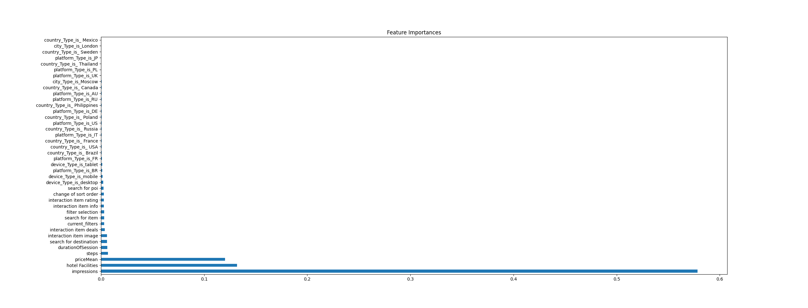
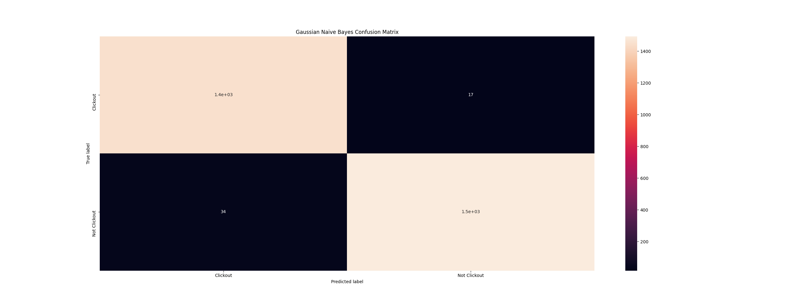
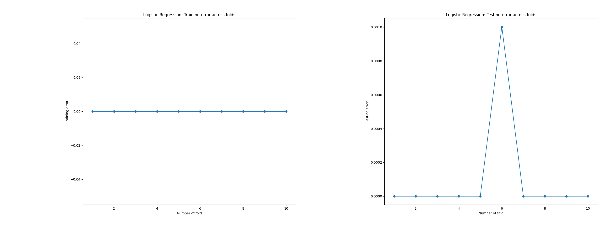
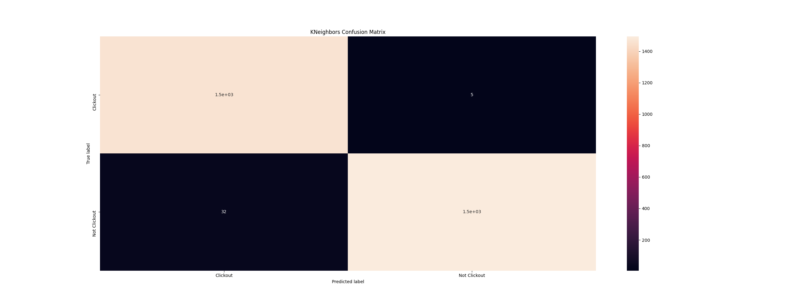
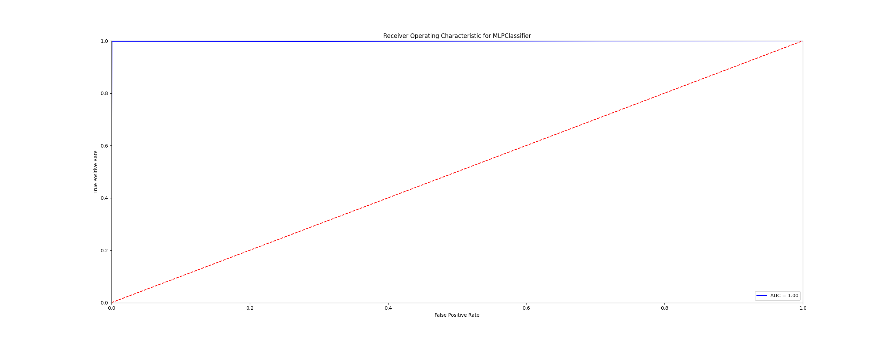

# Trivago RecSys Challenge 2019

The task is to predict whether a user will select (i.e. click on a selected) an item based on his/her online behavior during a session.

In order to predict the target value, we should transform the original data as follows.

We group the rows from the original dataset by user id, on top of that we compute:

1.  The total duration of the user's session by subtract the last timestamp from the fist timestamp.
2.  The total steps that the user proceeded. 
3.  The device that the user used for the search.
4.  The current city of the search context.
5.  The current country of the search context.
6.  The country platform that was used for the search, e.g. trivago.de (DE) or trivago.com (US)
7.  The total count of filters that user proceed in a session.
8.  The sum of the impression was shown when the user click-out.
9.  The median of the hotel's prices that displayed in user.
10. The sum of all the facilities that hotels are offering .
11. Create a column for each type of action and count the total action of them.
12. Create a target column to indicate if the user click out or not.

The generated csv from generateCsv.py (see on data folder export_dataframe.csv) consist of the following features:

1. durationOfSession
2. steps
3. device
4. city
5. country
6. platform
7. current_filters
8. impressions
9. priceMean
10. hotel Facilities
11. interaction item image
12. search for poi
13. filter selection
14. interaction item info
15. search for destination
16. interaction item rating
17. change of sort order
18. interaction item deals
19. search for item
20. target

### Data Description

Initial dataset: (1048575, 12)
Generated dataset: (58529, 20)
Print missing values:  0

### Data Preprocessing

#### Detect Imbalanced Classes

In generated dataset the target values are 4985 rows for class:0 (not clickout) and 53544 rows for class:1 (clickout).

As we can observe that the dataset is imbalance, therefor we should delete some values from the majority class in order to balance the data set.

The final balanced dataset consist of 9970 observers.

### Correlation HeatMap

As we can observe from the previous image. We are able to drop the column interaction the image since is high correlated with steps.
Another observation is that that feature impressions is high correlated with the target feature, and that can help as for the predictions. 

### Detect Outliers

### One Hot encoding

In order to convert the categorical variables as binary vectors we use the one hot encoding.
After converting the categorical variables as binary, created a problem since some columns has many different values.

| Column    | 
| ----------|:-------------:
| Country   | 135
| City      | 3387     
| Platform  | 54

### Splitting the dataset into Training and Test Set

We split the data 70-30, that means 70% for train and 30% for testing.
To guarantee that the output of every split will be the same we use random_state

#### Feature Importance

We use SelectKBest in order to select those features that they contribute most to the target variable.

#### Advantages:
1. Reduces Overfitting
2. Improves Accuracy
3. Reduces Training Time

https://www.kaggle.com/jepsds/feature-selection-using-selectkbest?utm_campaign=News&utm_medium=Community&utm_source=DataCamp.com

### Feature Scaling

## Data Visualization

### 1.Gaussian Naive Bayes 

| Confusion Matrix| :          
| ---- |:-----:
| 1448 | 17   |
| 34   | 1492 |

AUC: 0.98

| Evaluation    | Gaussian Naive Bayes           
| ------------- |:-------------:
| Accuracy      | 0.98 %
| Recall        | 0.98 %     
| Precision     | 0.99 %     
| F-measure     | 0.98 %      
| Macro Precision, recall, f1-score | 0.9828961453948375, 0.983057716307552, 0.9829451557415494
| Micro Precision, recall, f1-score | 0.9829488465396189, 0.9829488465396189, 0.9829488465396189

### 2.Logistic Regression

#### Bias–Variance Tradeoff

| Confusion Matrix| :          
| ---- |:-----:
| 1465 | 0    |
| 0    | 1526 |

AUC: 1.00

| Evaluation    | Logistic Regression           
| ------------- |:-------------:
| Accuracy      | 1.0 % 
| Recall        | 1.0 %     
| Precision     | 1.0 %     
| F-measure     | 1.0 %      
| Macro Precision, recall, f1-score | 1.0, 1.0, 1.0
| Micro Precision, recall, f1-score | 1.0, 1.0, 1.0

### 3.Decision Tree

#### Bias–Variance Tradeoff

| Confusion Matrix| :       
| ---- |:-----:
| 1458 - 7    |
| 14   - 1512 |

AUC: 0.99

| Evaluation    | Decision Tree           
| ------------- |:-------------:
| Accuracy      | 0.99 % 
| Recall        | 0.99 %     
| Precision     | 1.0 %     
| F-measure     | 0.99 %      
| Macro Precision, recall, f1-score | 0.9932786056746217, 0.9933514195357824, 0.9933110113589807
| Micro Precision, recall, f1-score | 0.9933132731527917, 0.9933132731527917, 0.9933132731527917

### 5.KNeighbors

#### Bias–Variance Tradeoff

| Confusion Matrix| :          
| ---- |:-----:
| 1460 | 5    |
| 32   | 1494 |

AUC: 0.99

| Evaluation    | KNeighbors           
| ------------- |:-------------:
| Accuracy      | 0.99 % 
| Recall        | 0.99 %     
| Precision     | 1.0 %     
| F-measure     | 0.99 %      
| Macro Precision, recall, f1-score | 0.987608360891175, 0.9878085874422411, 0.987627956634628
| Micro Precision, recall, f1-score | 0.9876295553326646, 0.9876295553326646, 0.9876295553326646

### 5.Random Forest

#### Bias–Variance Tradeoff

| Confusion Matrix| :          
| ---- |:-----:
| 1462 | 3    |
| 12   | 1514 |

AUC: 1.00

| Evaluation    | Random Forest          
| ------------- |:-------------:
| Accuracy      | 0.99 % 
| Recall        | 0.99 %     
| Precision     | 1.0 %     
| F-measure     | 0.99 %      
| Macro Precision, recall, f1-score | 0.9946037744286929, 0.994716607249093, 0.994649062780931
| Micro Precision, recall, f1-score | 0.9946506185222334, 0.9946506185222334, 0.9946506185222334

### 6.Support Vector Machine

Linear

| Confusion Matrix| :          
| ---- |:-----:
| 1465 | 0    |
| 0    | 1526 |

AUC: 1.00

| Evaluation    | Support Vector Machine          
| ------------- |:-------------:
| Accuracy      | 1.0 % 
| Recall        | 1.0 %     
| Precision     | 1.0 %     
| F-measure     | 1.0 %     
| Macro Precision, recall, f1-score | 1.0, 1.0, 1.0
| Micro Precision, recall, f1-score | 1.0, 1.0, 1.0   

Non-Linear

#### Bias–Variance Tradeoff

| Confusion Matrix| :          
| ---- |:-----:
| 1371 | 94   |
| 6    | 1520 |

AUC: 0.97

| Evaluation    | Support Vector Machine          
| ------------- |:-------------:
| Accuracy      | 0.97 % 
| Recall        | 1.0 %     
| Precision     | 0.94 %     
| F-measure     | 0.97 %     
| Macro Precision, recall, f1-score | 0.968, 0.965, 0.966
| Micro Precision, recall, f1-score | 0.966, 0.966, 0.966   

### 7.MLPClassifier

#### Bias–Variance Tradeoff

| Confusion Matrix| :          
| ---- |:-----:
| 1464 | 1    |
| 2   | 1524 |

AUC: 1.00

| Evaluation    | MLPClassifier          
| ------------- |:-------------:
| Accuracy      | 1.0 % 
| Recall        | 1.0 %     
| Precision      | 1.0 %     
| F-measure     | 1.0 %      
| Macro Precision, recall, f1-score | 0.9986494211229732, 0.998675741079536, 0.9986621340549728
| Micro Precision, recall, f1-score | 0.9986626546305584, 0.9986626546305584, 0.9986626546305584  

### Computation Time

| Model | Time (in seconds) |
| --- | --- |
| Gaussian Naive Bayes | 0.3 |
| Logistic Regression: | 0.06 |
| KNeighbors: | 0.13 |
| Random Forest | 0.78 |
| Decision Tree | 0.06 |
| Support Vector Machine | 0.24 |
| MLPClassifier: | 1.42 |

### Feature Work 
Analysis mote the current_filters column