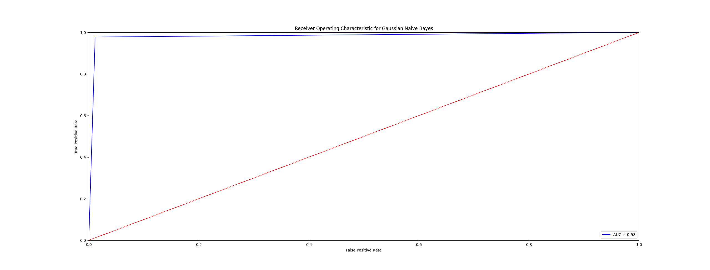
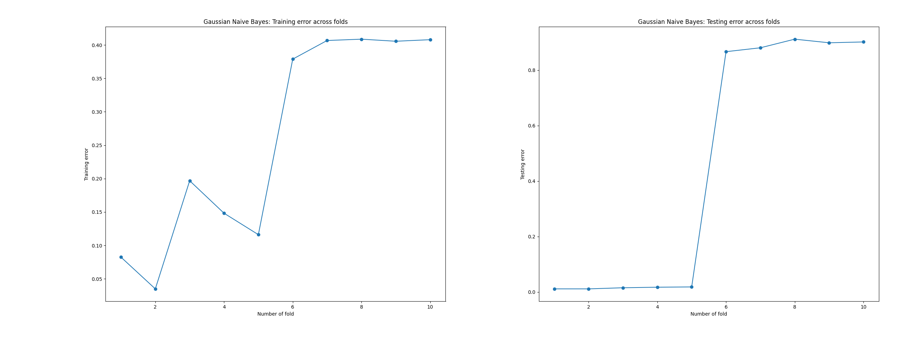
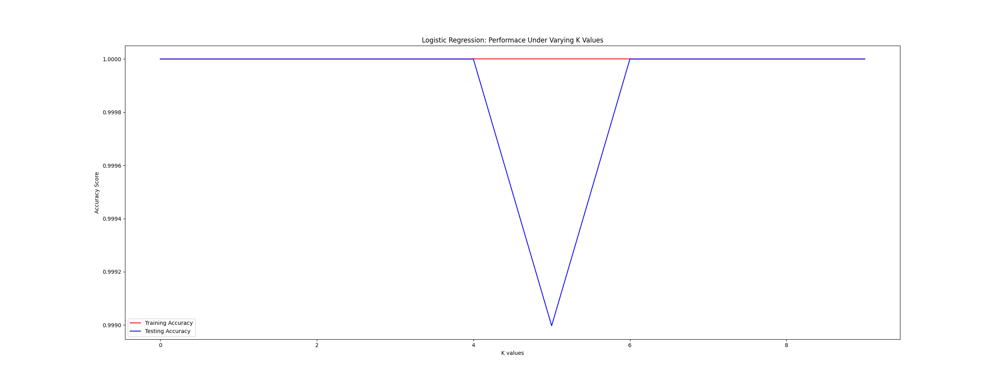

# Trivago RecSys Challenge 2019

The task is to predict whether a user will select (i.e. click on a selected) an item based on his/her online behavior during a session.

In order to predict the target value, we should transform the original data as follows.

We group the rows from the original dataset by user id, on top of that we compute:

1.  The total duration of the user's session by subtract the last timestamp from the fist timestamp.
2.  The total steps that the user proceeded. 
3.  The device that the user used for the search.
4.  The current city of the search context.
5.  The current country of the search context.
6.  The country platform that was used for the search, e.g. trivago.de (DE) or trivago.com (US)
7.  The total count of filters tha user proceed in a session.
8.  The sum of the impression was shown when the user click-out.
9.  The median of the hotel's prices that displayed in user.
10. The sum of all the facilities that hotels are offering .
11. Create a column for each type of action and count the total action of them.
12. Create a target column to idicate if the user click out or not.

The generated csv from generateCsv.py (see on data folder export_dataframe.csv) consist of the following features:

1. durationOfSession
2. steps
3. device
4. city
5. country
6. platform
7. current_filters
8. impressions
9. priceMean
10. hotel Facilities
11. interaction item image
12. search for poi
13. filter selection
14. interaction item info
15. search for destination
16. interaction item rating
17. change of sort order
18. interaction item deals
19. search for item
20. target

Gradient Descent
Correlation matrix
Variance Inflation Factor (VIF) is fo regression
https://medium.com/analytics-vidhya/what-is-multicollinearity-and-how-to-remove-it-413c419de2f
TODO: # Descriptive statistics for each column
features.describe()
feature_importances_
#TODO:  logistic regression, random forest regressor

### Data Description
Initial dataset: (58529, 20)
Print missing values:  0
Generated dataset: (58529, 20)

### Data Preprocessing

#### Detect Imbalanced Classes

In generated dataset the target values are 4985 rows for class:0 (not clickout) and 53544 rows for class:1 (clickout).

As we can obser the dataset is imbalance, therefor we should delete some values from the majority class in order to balanche the data set

The final balanche dataset consist of 9970 observers.

### Detect Missing Data

### Detect Outlier

### One Hot encoding
In order to convert the categorical variables as binary vectors we use the one hot encoding.
TODO: add the categorical values

### Splitting the data-set into Training and Test Set
This ensures that the random numbers are generated in the same order we use the random_state.

#### Feature Importance
We use SelectKBest in order to select those features that they have the strongest relationship with the output variable.

### Feature Scaling

## Data Visualization

### 1.Gaussian Mixture

| Evaluation    | Gaussian Mixture          
| ------------- |:-------------:
| Accuracy      | 0.98 %
| Recall        | 0.98 %     
| Precesion     | 0.99 %     
| F-measure     | 0.98 %      

### 2.Logistic Regression

| Evaluation    | Logistic Regression           
| ------------- |:-------------:
| Accuracy      | 1.0 % 
| Recall        | 1.0 %     
| Precesion     | 1.0 %     
| F-measure     | 1.0 %      

### 3.Decision Tree

| Evaluation    | Decision Tree           
| ------------- |:-------------:
| Accuracy      | 0.99 % 
| Recall        | 0.99 %     
| Precesion     | 1.0 %     
| F-measure     | 0.99 %      

### 5.KNeighbors

| Evaluation    | KNeighbors           
| ------------- |:-------------:
| Accuracy      | 0.99 % 
| Recall        | 0.99 %     
| Precesion     | 1.0 %     
| F-measure     | 0.99 %      

### 5.Random Forest

| Evaluation    | Random Forest          
| ------------- |:-------------:
| Accuracy      | 0.99 % 
| Recall        | 0.99 %     
| Precesion     | 1.0 %     
| F-measure     | 0.99 %      

### 6.Support Vector Machine

| Evaluation    | Support Vector Machine          
| ------------- |:-------------:
| Accuracy      | 1.0 % 
| Recall        | 1.0 %     
| Precesion     | 1.0 %     
| F-measure     | 1.0 %      

### 7.MLPClassifier

| Evaluation    | MLPClassifier          
| ------------- |:-------------:
| Accuracy      | - 
| Recall        | -     
| Precesion     | -     
| F-measure     | -      

### Feature Work 
Analysis mote the current_filters column